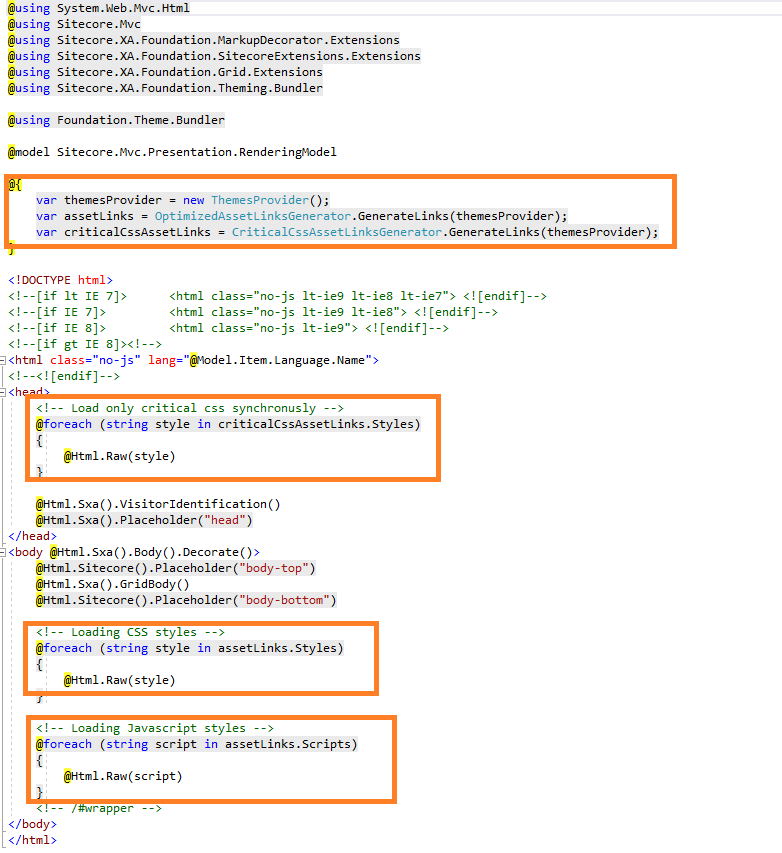
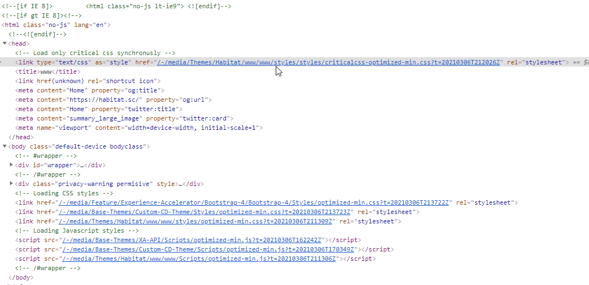

# Hackathon Submission Entry form

## Team name
DreamTeam

## Category
The best enhancement to SXA

## Description
This module will help to make more flexible and allow to be more configurable of `SxA Themes`. What does it mean: SxA has powerful module called `Theme` where each `Site`  can have own set of styles, scripts, fonts, images etc. As well, this module includes some `Base Theme` as a common set of front-end stuff across all `Sites`.
The most painful problem which every business try to resolve is performance optimization. Using Lighhouse as part of Google Page Speed Insight business faced with some recommendations from this tool, and one of recommendations, is to reduce amount of unused .js and .css files, make them smaller, keep only styles and js code related to the components on your page. It's really had to do with current `Theme` stuff in `SxA`. 
Specifically for this reason we have 3 enhancement in `SxA Theme` module which will mitigate a problems described above.
As we are know, if not then we can type in Google something like this `critical css sxa sitecore` and get a lot of recommendations to improve this situation. Here the options which we can enhance with `SxA Theme`:
1. __Remove unused css and js code from CD env.__
⋅⋅*Typically when we rendering a page on CD env. all js and css from `Base Themes` as well loading on a page. With our module will be possible to specify what should be included from `Base Theme` into a live page witnin `AssetLinksGenerator` output.
2. __Use critical css for the page__
⋅⋅*Of course, critical css should improve page performance and should be loaded above the page as fast as possible. One problem for the developer to identify css which are critical (it depends from first page elements and require research those critical components over pages), the second one, how to distinguish those css entry, since, it is part of `Site Theme` and, of course, this should be separate out `optimized-min` file.
3. __Use css and js which are required by components on a page__
⋅⋅*This is the most hardest part, since, require specific service which will collect base on list of `Renderings` on a page scope of js and css files which should be optimized on fly and embedded with `AssetLinksGenerator` output.
4. And the last one: of course, __use js, css deffer approach, direct font loading, use cache, optimize media, use CDN etc.__

## Video link
⟹ [Link on a Video](https://youtu.be/nR8q74RPDUY)

## Pre-requisites and Dependencies

⟹ Does your module rely on other Sitecore modules or frameworks?
- Sitecore SxA framework

## Installation instructions
1. Use the Sitecore Installation wizard to install the [package](docs/package/DreamTeam Installation Package.zip)

## Usage instructions
This module contains specific templates: `/sitecore/templates/Foundation/DreamTeam/Theming/Theme` which allow to extend and configurate `Theming` module in SxA. We have two interface templates: `/sitecore/templates/Foundation/DreamTeam/Theming/_ThemeSettings` and `/sitecore/templates/Foundation/DreamTeam/Theming/_ThemeCriticalCSS`.
The first one, contains a field called: `LoadSelectedThemesOnContentDelivery` used to specify which base theme items to load out side Exp Editor base on a list of `Base Themes` items.
The second templates, contains two fields: `CriticalCSS` and `Enabled`. Within first field you can specify from a list under current theme select media css items which will be use as part of `criticalcss-optimized-min` file (generated on fly during page load and chached after page loaded). The second field allows to enable (by default, this feature is disabled) generation of critical css for the whole theme.

We modified standard sxa layout file: 

As a result of this enhancement:
Here how list of css and js files was before:

Now:

Plus, we have critical css optimized-min file on a top of the page in `head` tag. This will allow to paint first age element much faster and will improve `First Contentful Paint (FCP)` performance metric 

## Comments
Thanks for watching. Do not hesitate to contact me or our team with any questions :).
